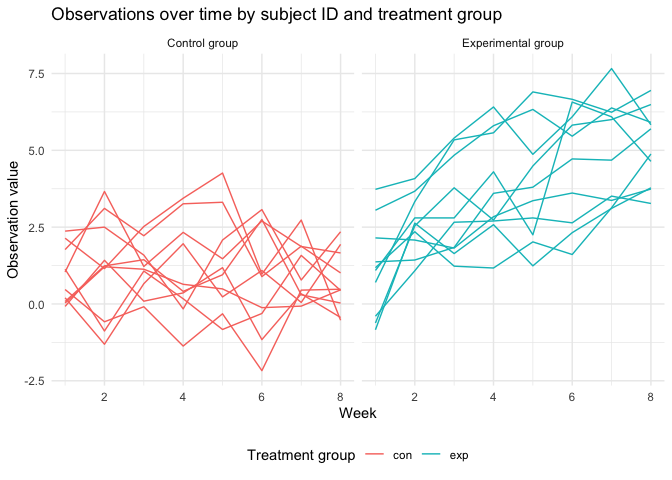

Homework 5
================
Sarah Younes

As always, I will begin by loading the packages I will need for this
assignment: tidyverse. I will also use `set.seed` so that I get the same
values in Problem 3 when I generate data sets.

``` r
library(tidyverse)
set.seed(1)
```

## Problem 1

First, I will import the data.

``` r
homicide_data =
  read.csv("./data/homicide-data.csv")
```

Next, I will clean the data.

``` r
homicide_data =
  homicide_data |>
  janitor::clean_names() |>
  mutate(
    victim_last = str_to_title(victim_last),
    victim_first = str_to_title(victim_first)) |>
  mutate(city_state = paste(city, state, sep = ", "))
```

Now, I will summarize within cities to obtain the total number of
homicides and the total number of unsolved homicides, and I will show
both of these values for each city.

``` r
total_homicides =
  homicide_data |>
  group_by(city) |>
  summarize(
    total_homicides = n())

unresolved_homicides =
  homicide_data |>
  filter(disposition == "Closed without arrest" | disposition == "Open/No arrest") |>
  group_by(city) |>
  summarize(
    unresolved_homicides = n())

city_summaries =
  full_join(total_homicides, unresolved_homicides, by = "city") |>
  print(n = Inf)
```

    ## # A tibble: 50 × 3
    ##    city           total_homicides unresolved_homicides
    ##    <chr>                    <int>                <int>
    ##  1 Albuquerque                378                  146
    ##  2 Atlanta                    973                  373
    ##  3 Baltimore                 2827                 1825
    ##  4 Baton Rouge                424                  196
    ##  5 Birmingham                 800                  347
    ##  6 Boston                     614                  310
    ##  7 Buffalo                    521                  319
    ##  8 Charlotte                  687                  206
    ##  9 Chicago                   5535                 4073
    ## 10 Cincinnati                 694                  309
    ## 11 Columbus                  1084                  575
    ## 12 Dallas                    1567                  754
    ## 13 Denver                     312                  169
    ## 14 Detroit                   2519                 1482
    ## 15 Durham                     276                  101
    ## 16 Fort Worth                 549                  255
    ## 17 Fresno                     487                  169
    ## 18 Houston                   2942                 1493
    ## 19 Indianapolis              1322                  594
    ## 20 Jacksonville              1168                  597
    ## 21 Kansas City               1190                  486
    ## 22 Las Vegas                 1381                  572
    ## 23 Long Beach                 378                  156
    ## 24 Los Angeles               2257                 1106
    ## 25 Louisville                 576                  261
    ## 26 Memphis                   1514                  483
    ## 27 Miami                      744                  450
    ## 28 Milwaukee                 1115                  403
    ## 29 Minneapolis                366                  187
    ## 30 Nashville                  767                  278
    ## 31 New Orleans               1434                  930
    ## 32 New York                   627                  243
    ## 33 Oakland                    947                  508
    ## 34 Oklahoma City              672                  326
    ## 35 Omaha                      409                  169
    ## 36 Philadelphia              3037                 1360
    ## 37 Phoenix                    914                  504
    ## 38 Pittsburgh                 631                  337
    ## 39 Richmond                   429                  113
    ## 40 Sacramento                 376                  139
    ## 41 San Antonio                833                  357
    ## 42 San Bernardino             275                  170
    ## 43 San Diego                  461                  175
    ## 44 San Francisco              663                  336
    ## 45 Savannah                   246                  115
    ## 46 St. Louis                 1677                  905
    ## 47 Stockton                   444                  266
    ## 48 Tampa                      208                   95
    ## 49 Tulsa                      584                  193
    ## 50 Washington                1345                  589

## Problem 2

First, I will start with a data frame containing all file names.

``` r
csv_files =
  list.files(path = "./data/problem_2", pattern = "\\.csv$", full.names = TRUE)

csv_files_df =
  csv_files |>
  tibble()
```

First, I will create a data frame containing all file names via
`list.files` and paths. Then, I will use `purrr::map` to import each csv
file into the data frame, and all their data is saved as a new `data`
variable in the data frame.

``` r
df =
  tibble(
    files = list.files("./data/problem_2/", pattern = "\\.csv$"),
    path = str_c("./data/problem_2/", files)) |>
  mutate(
    data = map(path, read_csv))

df
```

    ## # A tibble: 20 × 3
    ##    files      path                        data              
    ##    <chr>      <chr>                       <list>            
    ##  1 con_01.csv ./data/problem_2/con_01.csv <spc_tbl_ [1 × 8]>
    ##  2 con_02.csv ./data/problem_2/con_02.csv <spc_tbl_ [1 × 8]>
    ##  3 con_03.csv ./data/problem_2/con_03.csv <spc_tbl_ [1 × 8]>
    ##  4 con_04.csv ./data/problem_2/con_04.csv <spc_tbl_ [1 × 8]>
    ##  5 con_05.csv ./data/problem_2/con_05.csv <spc_tbl_ [1 × 8]>
    ##  6 con_06.csv ./data/problem_2/con_06.csv <spc_tbl_ [1 × 8]>
    ##  7 con_07.csv ./data/problem_2/con_07.csv <spc_tbl_ [1 × 8]>
    ##  8 con_08.csv ./data/problem_2/con_08.csv <spc_tbl_ [1 × 8]>
    ##  9 con_09.csv ./data/problem_2/con_09.csv <spc_tbl_ [1 × 8]>
    ## 10 con_10.csv ./data/problem_2/con_10.csv <spc_tbl_ [1 × 8]>
    ## 11 exp_01.csv ./data/problem_2/exp_01.csv <spc_tbl_ [1 × 8]>
    ## 12 exp_02.csv ./data/problem_2/exp_02.csv <spc_tbl_ [1 × 8]>
    ## 13 exp_03.csv ./data/problem_2/exp_03.csv <spc_tbl_ [1 × 8]>
    ## 14 exp_04.csv ./data/problem_2/exp_04.csv <spc_tbl_ [1 × 8]>
    ## 15 exp_05.csv ./data/problem_2/exp_05.csv <spc_tbl_ [1 × 8]>
    ## 16 exp_06.csv ./data/problem_2/exp_06.csv <spc_tbl_ [1 × 8]>
    ## 17 exp_07.csv ./data/problem_2/exp_07.csv <spc_tbl_ [1 × 8]>
    ## 18 exp_08.csv ./data/problem_2/exp_08.csv <spc_tbl_ [1 × 8]>
    ## 19 exp_09.csv ./data/problem_2/exp_09.csv <spc_tbl_ [1 × 8]>
    ## 20 exp_10.csv ./data/problem_2/exp_10.csv <spc_tbl_ [1 × 8]>

Next, I will clean the data to unnest all the weekly data from the
`data` variable, create ID and study arm variables,tidy the week
variable, set `week` as a numeric value, and select the variables I
need.

``` r
tidy_df =
  df |>
  unnest(cols = c(data)) |>
  mutate(
    id = str_extract(files, "\\d+"),
    arm = str_extract(files, "con|exp")) |>
  pivot_longer(
    week_1:week_8,
    names_to = "week",
    names_prefix = "week_",
    values_to = "value") |>
  mutate(
    week = as.numeric(week)) |>
  select(id, arm, week, value)

tidy_df
```

    ## # A tibble: 160 × 4
    ##    id    arm    week value
    ##    <chr> <chr> <dbl> <dbl>
    ##  1 01    con       1  0.2 
    ##  2 01    con       2 -1.31
    ##  3 01    con       3  0.66
    ##  4 01    con       4  1.96
    ##  5 01    con       5  0.23
    ##  6 01    con       6  1.09
    ##  7 01    con       7  0.05
    ##  8 01    con       8  1.94
    ##  9 02    con       1  1.13
    ## 10 02    con       2 -0.88
    ## # ℹ 150 more rows

Now, I will make a spaghetti plot showing the observations for each
subject over time by study arm/treatment group (experimental
vs. control). Most study participants started around the same values.
The control group remained mostly the same over the 8 weeks whereas the
experimental arm saw larger improvements, which indicates there was
likely not a placebo effect among the control group.

``` r
tidy_df |>
  ggplot(aes(x = week, y = value, color = id)) +
  geom_line() +
  facet_grid(. ~ arm, labeller = labeller(arm = c(con = "Control group", exp = "Experimental group"))) +
  labs(
    x = "Week",
    y = "Observation value",
    title = "Observations over time by subject ID and treatment group",
    color = "Subject ID")
```

<!-- -->

``` r
tidy_df |>
  ggplot(aes(x = week, y = value, group = id, color = arm)) +
  geom_path() +
  facet_grid(. ~ arm, labeller = labeller(arm = c(con = "Control group", exp = "Experimental group"))) +
  labs(
    x = "Week",
    y = "Observation value",
    title = "Observations over time by subject ID and treatment group",
    color = "Treatment group")
```

<!-- -->


    ## Problem 3

    First, I will create a function that runs a one-sample t-test with n = 30, mu = 0,  sigma = 5, and an alpha level of 0.05.


    ```r
    t_test_simulations = function(n = 30, mu = 0, sigma = 5) {
      
        data =
          tibble(
            x = rnorm(n = n, mean = mu, sd = sigma))

        t_test =
          t.test(data, mean = mu, conf.level = 1 - 0.05) |>
          broom::tidy() |>
          select(estimate, p.value)
       
      return(t_test)

    }

    ## test function

    t_test_simulations(n = 20, mu = 0, sigma = 5)

    ## # A tibble: 1 × 2
    ##   estimate p.value
    ##      <dbl>   <dbl>
    ## 1    0.953   0.363

Now, I will run the function 5000 times with mu = 0.

``` r
output = vector("list", 5000)

for(i in 1:5000) {
  
  output[[i]] = t_test_simulations(n = 30, mu = 0, sigma = 5)
  
}

sim_results = bind_rows(output)
```

Now, I will run the function 5000 times with mu = 1:6.
